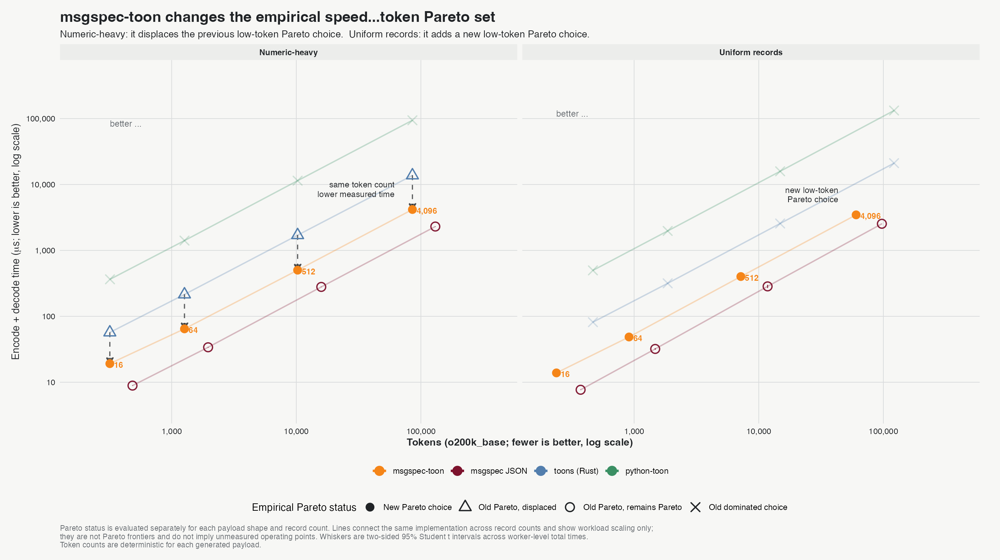
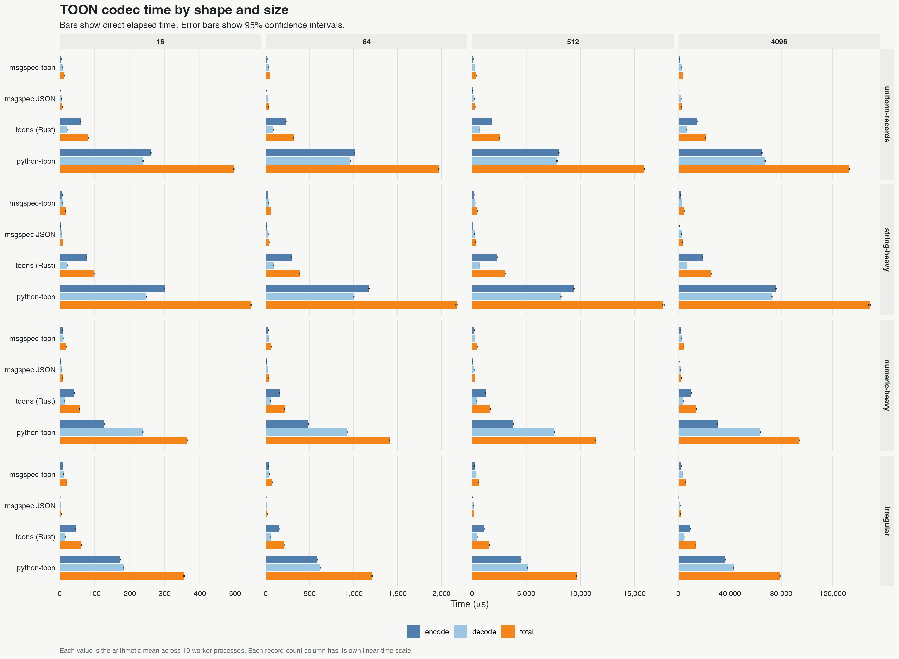
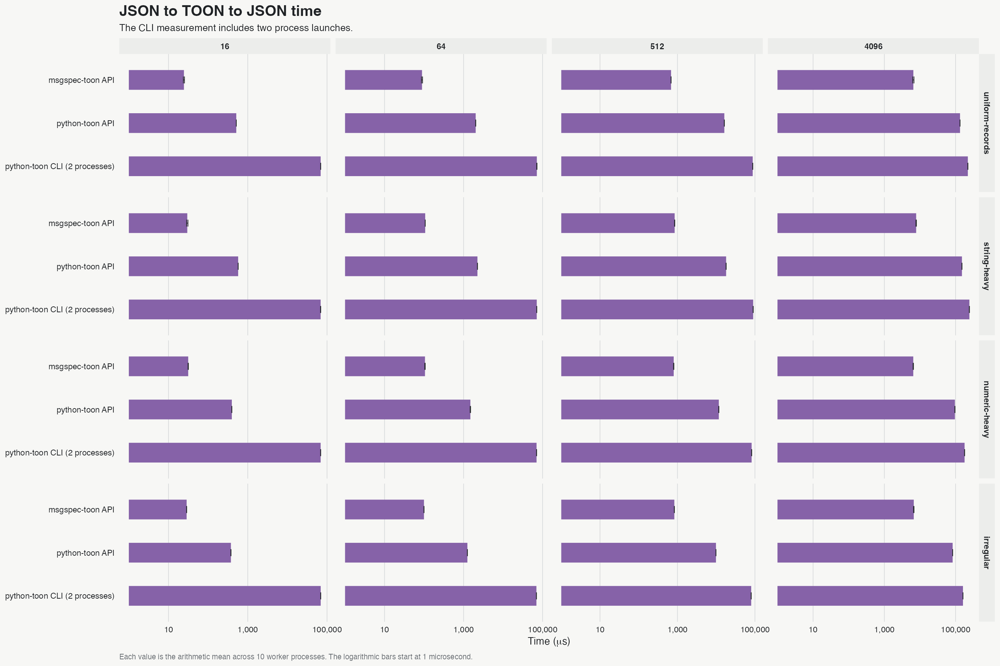
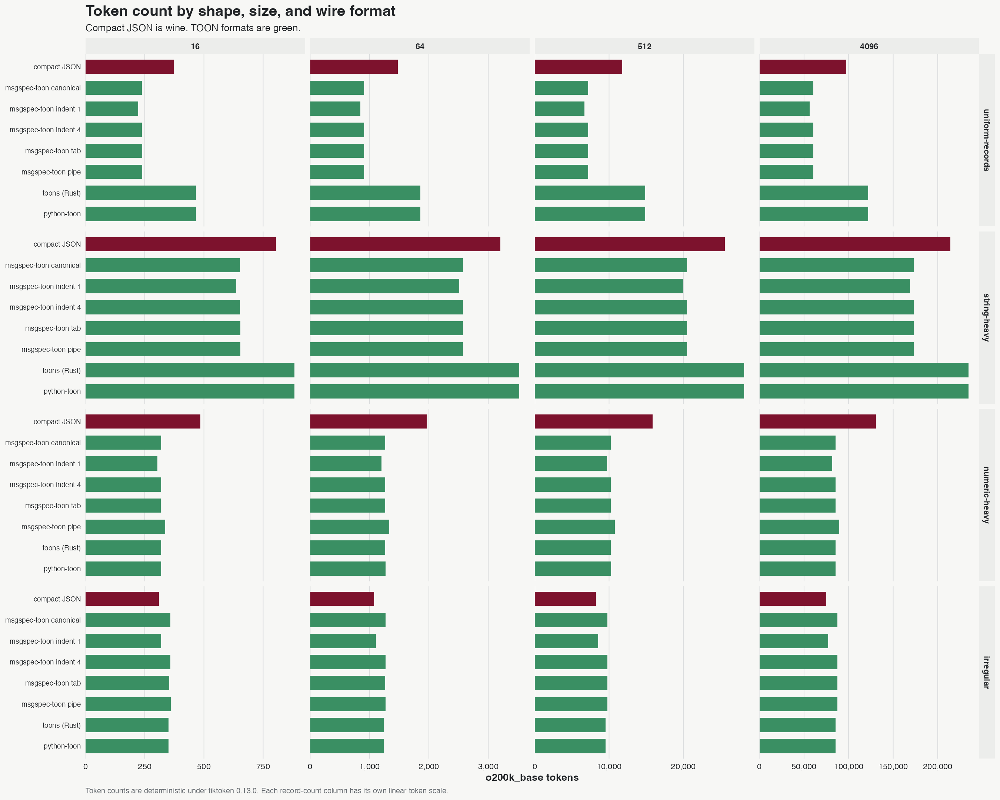

# Benchmarks

Generated from [`conformance/report.json`](conformance/report.json) on 2026-08-13T05:56:31.014883+00:00.

The report keeps time and token results separate. It does not create a combined score.

## Speed and token Pareto set

Pareto status is calculated independently for each payload shape and record count. Lines connect the same implementation across record counts. They show workload scaling, not an unmeasured continuous Pareto curve.

## Codec time

The chart shows encode, decode, and total elapsed time. Every value is a direct measurement in microseconds.

### Uniform records at 4,096 records

| Codec | Encode (µs) | Decode (µs) | Total (µs) |
|---|---:|---:|---:|
| msgspec-toon | 977.79 | 2,483.66 |  3,461.45 |
| msgspec JSON | 452.45 | 2,082.52 |  2,534.97 |
| toons (Rust) | 14,661.81 | 6,406.77 |  21,068.58 |
| python-toon | 64,963.34 | 67,527.55 |  132,490.89 |

## End-to-end time

The API rows run in one Python process. The CLI row includes two process launches.

## Token count

Compact JSON appears in every facet. This gives a direct reference for each shape and size.

### Uniform records at 4,096 records

| Wire format | o200k_base tokens |
|---|---:|
| compact JSON | 97,308 |
| msgspec-toon canonical | 60,455 |
| msgspec-toon indent 1 | 56,359 |
| msgspec-toon indent 4 | 60,455 |
| msgspec-toon tab | 60,456 |
| msgspec-toon pipe | 60,456 |
| toons (Rust) | 121,884 |
| python-toon | 121,884 |

## Method

- The timing estimator is the arithmetic mean across 10 worker processes.
- Each worker reports 3 samples after warm-up.
- The error bars are two-sided 95% Student t confidence intervals across worker means.
- The benchmark never uses the minimum time.
- Codec order is fixed inside each worker. The intervals do not measure order bias.
- Token counts are deterministic under the named tokenizer.
- The environment uses Python 3.13.14 and msgspec 0.21.1.
- The build is a release `abi3-py313` build.
- The freshness check rejects stale and instrumented extensions.
- Raw evidence is in [`conformance/report.json`](conformance/report.json).
- Reproduce with `uv sync --group bench --locked && make g2 && make public-report`.

Results depend on the machine, payload, and package versions. Compare values from the same generated run.
