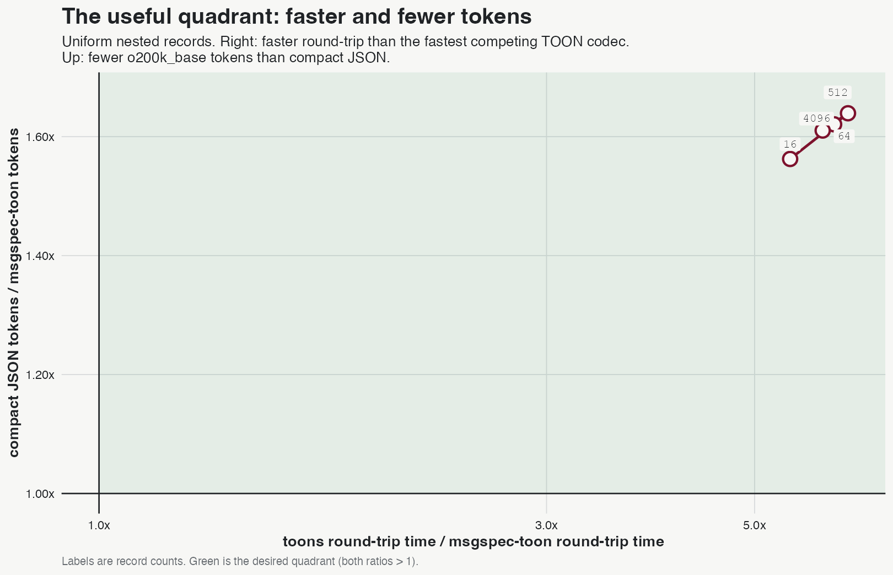
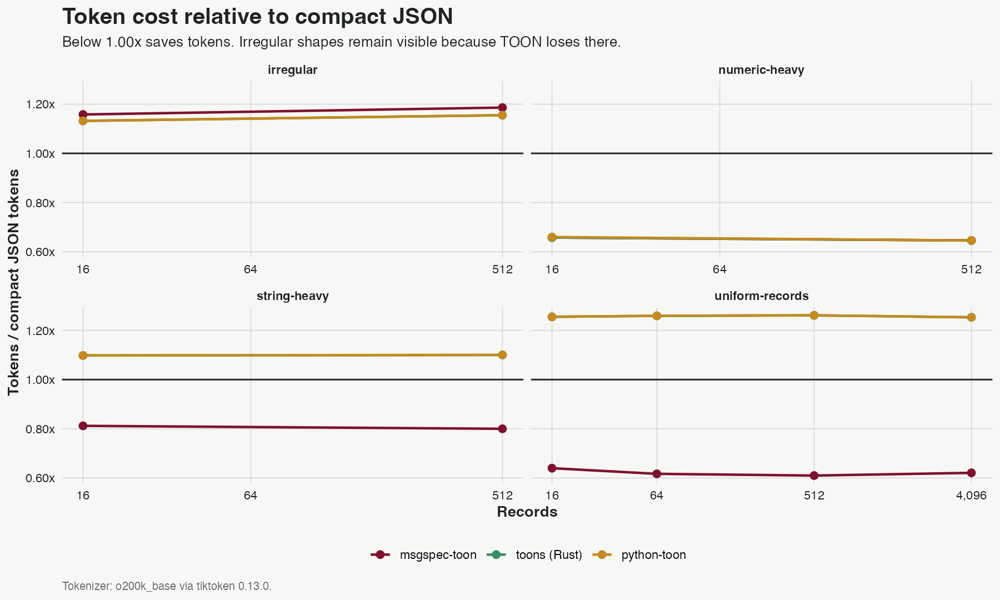
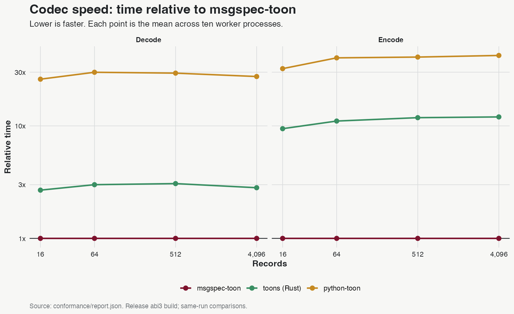
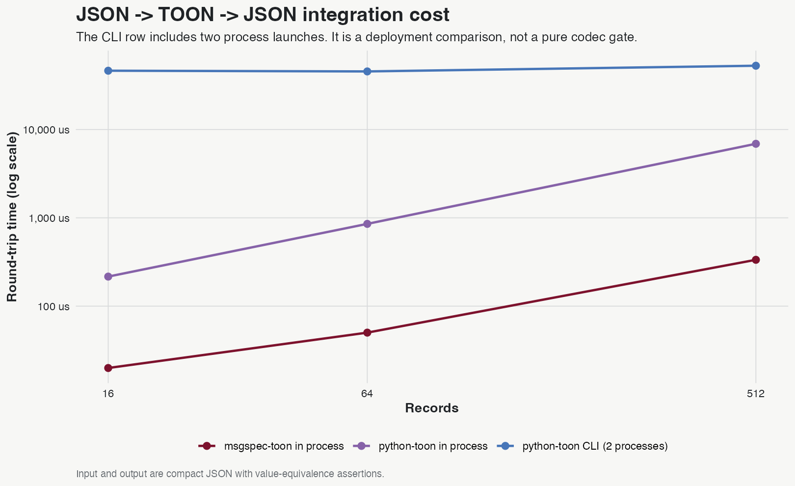

# Benchmarks

Generated from [`conformance/report.json`](conformance/report.json) on 2026-08-08T09:23:32.631591+00:00.

The charts publish both axes that matter: conversion time and tokens versus compact JSON. The JSON token baseline is not inferred from byte size. It is measured with the named tokenizer.

## Headline at 4,096 uniform records

| Measure | Result |
|---|---:|
| Canonical TOON tokens / compact JSON tokens | 0.62x |
| Round-trip speed / `toons` | 5.91x faster |
| Output bytes / compact JSON bytes | 0.38x |

These rows describe the uniform nested-record shape that TOON 4.1 can tabularize. They do not generalize to every document.

## Token cost by shape

Canonical TOON saves tokens for uniform, string-heavy, and numeric-heavy records. It costs more tokens than compact JSON for the measured irregular documents. Use JSON for those shapes when context-window cost is the priority.

## Codec speed

Each codec parses its own output. Older codecs emit a larger fallback form for the nested-record payload. The byte count is part of the result and is present in the raw report.

## Integration cost

At 512 records, JSON -> TOON -> JSON took 334.66 us in process with msgspec-toon, 6,889.95 us through the python-toon API, and 52,756.90 us through two CLI processes.

The CLI row measures a real architectural cost. It is not used as a pure codec performance gate.

## Method

- Environment: Python 3.13.1, msgspec 0.21.1, macOS-15.1-arm64-arm-64bit-Mach-O.
- Estimator: mean across 10 worker processes; each worker reports 3 post-warmup samples. The minimum is not used.
- Tokenizer: tiktoken `o200k_base` 0.13.0.
- Build: release `abi3-py313`; the freshness check rejects stale or instrumented extensions.
- Raw evidence: [`conformance/report.json`](conformance/report.json).
- Reproduce: `uv sync --group bench --locked && make g2 && make public-report`.

Benchmark results depend on the machine, payload, and versions. Compare rows from the same generated run.
